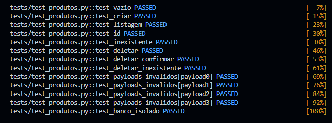

# API de Produtos


---

## Subindo os bancos PostgreSQL

```bash
docker-compose up -d
```

## Executando os testes

```bash
pytest -v
```

## Executando testes com cobertura
```bash
pytest --cov=main -v
```

## Executando servidor local 
```bash
uvicorn main:app --reload
```
---

## Saída esperada



---

## Como funciona o isolamento dos testes

A fixture `client` cria as tabelas antes de cada teste utilizando:

```python
Base.metadata.create_all()
```

e remove todas as tabelas ao final utilizando:

```python
Base.metadata.drop_all()
```

Dessa forma cada teste executa em um banco limpo, sem depender dos dados criados por outros testes.

---

## Tecnologias e Ferramentas

```text
- Python 3.12
- FastAPI (Framework web de alta performance)
- SQLAlchemy (ORM para mapeamento do banco)
- PostgreSQL 16 (Banco de dados relacional)
- Docker & Docker Compose (Conteinerização)
- Pytest (Framework de testes automatizados)
```
